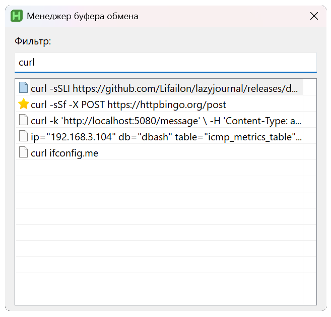
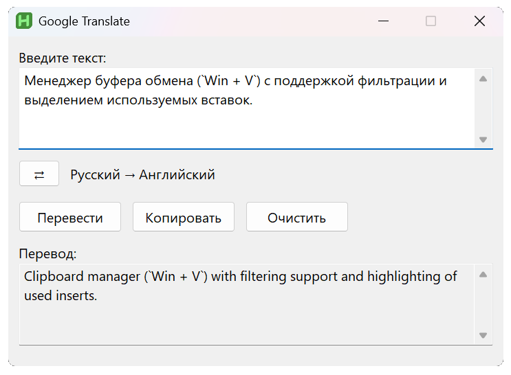
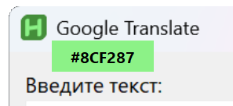

# AHK Scripts

Набор скриптов для [AutoHotkey](https://github.com/autohotkey/autohotkey).

- [Менеджер буфера обмена](scripts/clipboard-manager.ahk), который заменяет встроенный в WIndows 10 и 11 на `Win + V` с поддержкой фильтрации и ⭐ выделением используемых вставок.

- [Переводчик текста](scripts/google-translate.ahk) в Google Translate (`Ctrl + Q`).

- [Извлечение цвета](scripts/color-extraction.ahk) с экрана в формате HEX (`Win + C`).

- [Переключение раскладки](scripts/language-switch.ahk) выделенного текста с английского на русский язык и наоборот (`Win + Shift`).

- [Транслитерация текста](scripts/language-translite.ahk) на английский язык (`Win + T`).

- [Навигация с помощью мыши](scripts/mouse-navigation.ahk) по директориям в файловом менеджере и браузере (`Win` + колесико мыши).

- [Управление звуком](scripts/sound-control.ahk) с помощью колесика мыши при наведении на трей.

- [Управление яркостью дисплея монитора](scripts/screen-brigh-control.ahk) с помощью Win + колесико мыши при наведении на трей.

- [Отключение дисплечая монитора](scripts/screen-off.ahk) - блокировка экрана (`Ctrl + Alt + L`).