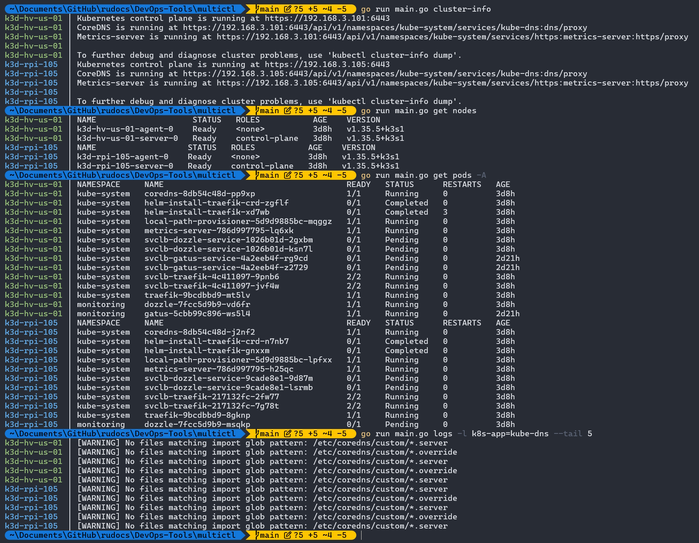

### mctl (Multi-Cluster kubectl)

Обертка над [kubectl](https://github.com/kubernetes/kubectl) для параллельного выполнения команд и чтения логов из всех доступных кластеров в `kubeconfig`.

Поддерживает параметр `-cf`/`--cluster-filter` для фильтрации контекстов с помощью wildcard шаблона.

