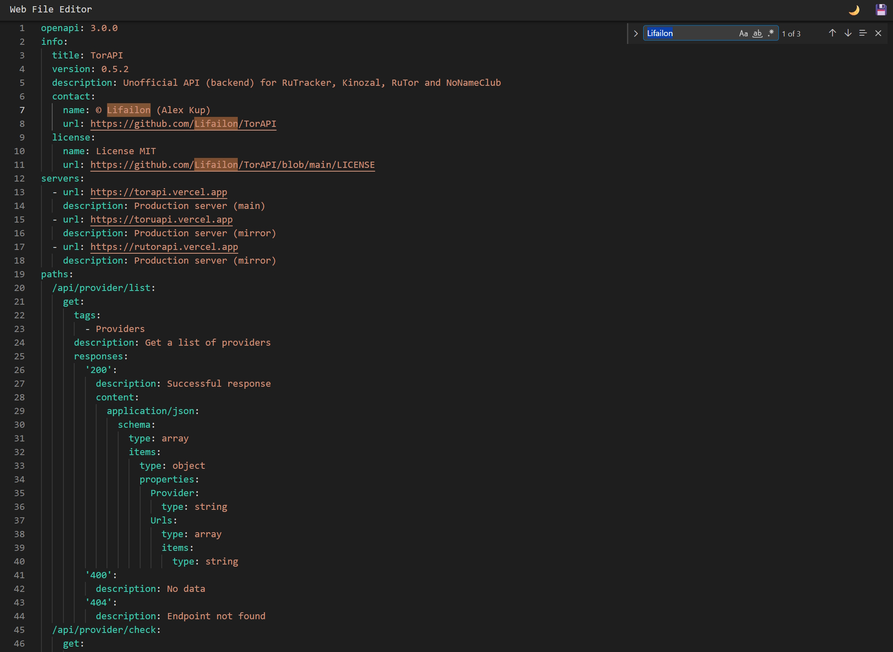

## Mona (Web File Editor)

Универсальный файловый редактор на базе [Monaco Editor](https://github.com/microsoft/monaco-editor) от Microsoft работающий в браузере с поддержкой подсветки синтаксиса (определение языка на основе расширения файла).

Это решение может являться альтернативой терминального редактора, например [nano](https://www.nano-editor.org) или [micro](https://micro-editor.github.io), повторяя пользовательский опыт *VSCode* с поддержкой знакомых горячих клавиш и быстрого поиска с массовой заменой.

```bash
go run main.go ..\swagger-ui\docs\torapi.yml
# или запустить в фоне
go run main.go ..\swagger-ui\docs\torapi.yml &
kill %1
```

