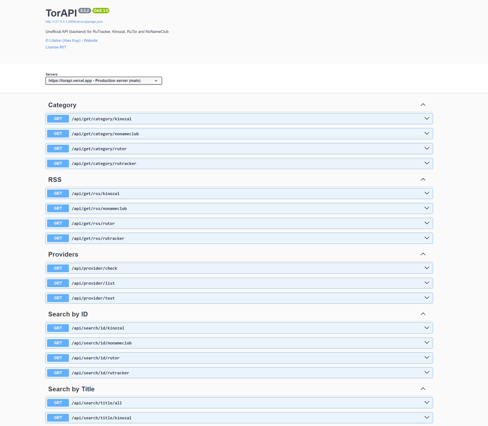

## Swagger UI

Позволяет запускать веб-интерфейс `Swagger UI` с помощью библиотеки [swgui](https://github.com/swaggest/swgui) для отображения спецификации `OpenAPI`.

```bash
go run main.go .\docs\torapi.json
```

