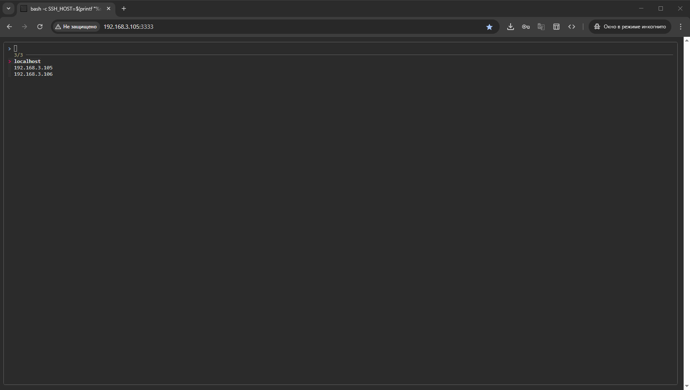

# Docker Web Manager

Переключайтесь между хостами для удаленного управления контейнерами Docker в браузере.

Этот проект стал возможен благодаря объединению возможностей популярных утилит. Осознавая, что это по большей части костыль, не вижу смысла выделять его в отдельный репозиторий, исходный код запуска и сборки образа доступен в [репозитории](https://github.com/Lifailon/PS-Commands/tree/rsa/Docker-Compose/docker-web/docker-web-manager) с заметками.

## Демо



## Как это работает?

Для выбора и фильтрации списка хостов используется интерфейс [fzf](https://github.com/junegunn/fzf), доступа к удаленным машинам осуществляется по средствам проброса сокета Docker через протокол `ssh`, управление контейнерами и другими сущностями Docker производится с помощью интерфейсов [lazydocker](https://github.com/jesseduffield/lazydocker) или [ctop](https://github.com/bcicen/ctop). Все это запускается в браузере, благодаря [ttyd](https://github.com/tsl0922/ttyd), с поддержкой базовой авторизации (также возможно настроить `SSL` или авторизацию через Proxy сервер для защиты подключения). Конечный образ включает клиент `docker-cli`, для возможности подключения к терминалу выбранного контейнера через метод `exec`.

## Чем это лучше других решений?

- Быстрый запуск, без необходимости сложных настроек.
- Возможность использовать любой привычный терминальный интерфейс для управления (вы можете самостоятельно добавить процесс сборки или установки любого инструмента в `Dockerfile`).
- Централизованный доступ к удаленным хостам, без необходимости установки агентов (клиентской части) или настройки сокета (публикации Docker API).

## Запуск

Для запуска контейнера, создайте `docker-compose.yaml` файл и используйте образ из [Docker Hub](https://hub.docker.com/r/lifailon/docker-web-manager):

```yml
services:
  docker-web-manager:
    image: lifailon/docker-web-manager:latest
    container_name: docker-web-manager
    restart: unless-stopped
    volumes:
      - /var/run/docker.sock:/var/run/docker.sock
      - $HOME/.ssh/id_rsa:/root/.ssh/id_rsa
    env_file:
      - .env
    ports:
      - "${WEB_PORT:-3333}:${WEB_PORT:-3333}"
```

Создайте файл `.env` и обновите параметры, для подключения к удаленным хостам, на которых установлен Docker:

```bash
WEB_PORT=3333
WEB_USERNAME=
WEB_PASSWORD=

SSH_HOSTS=localhost,192.168.3.105,192.168.3.106
SSH_USER=lifailon
SSH_PORT=2121

DOCKER_CLIENT=lazydocker
# DOCKER_CLIENT=ctop
```

## Альтернативы

[isaiah](https://github.com/will-moss/isaiah) - независимая и самостоятельная разработка клона `lazydocker` на базе Go и JavaScript для браузера (по этому, часть функций может быть недоступна или работать иначе, чем в оригинальном проекте). Для управления контейнерами на удаленных хостах, требуется установка агентов на конечные машины.