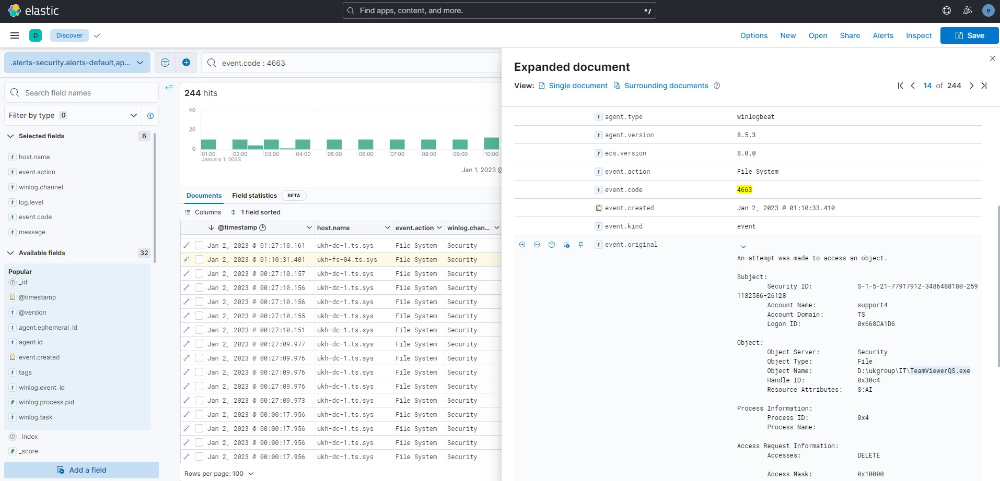

# ELK Stack

Заметки по запуску стека ELK (Elasticsearch + Logstash + Kibana) от января 2023 года для мониторинга Windows серверов (AD, SMB и Exchange).



```bash
wget -qO - https://artifacts.elastic.co/GPG-KEY-elasticsearch | apt-key add -
echo "deb https://artifacts.elastic.co/packages/8.x/apt stable main" | tee -a /etc/apt/sources.list.d/elastic-8.x.list
wget -qO - http://elasticrepo.serveradmin.ru/elastic.asc | apt-key add -
echo "deb http://elasticrepo.serveradmin.ru bullseye main" | tee /etc/apt/sources.list.d/elasticrepo.list
apt update

wget https://artifacts.elastic.co/downloads/elasticsearch/elasticsearch-8.2.3-amd64.deb # скачать
dpkg -i elasticsearch-*.deb # установить
```
## 1. Elasticsearch (NOSQL)

```bash
apt install elasticsearch
# Get:1 http://elasticrepo.serveradmin.ru bullseye/main amd64 elasticsearch amd64 8.5.2 [581 MB]
# The generated password for the elastic built-in superuser is : zDT*TbyD+LHkF5777=fl
# Reset the password of the elastic built-in superuser with
# /usr/share/elasticsearch/bin/elasticsearch-reset-password -u elastic
sudo systemctl daemon-reload
sudo systemctl enable elasticsearch.service
systemctl start elasticsearch.service
systemctl status elasticsearch.service
```
`curl -k -u elastic:'zDT*TbyD+LHkF5777=fl' https://127.0.0.1:9200 # тест HTTPS`
```bash
nano /etc/elasticsearch/elasticsearch.yml
path.data: /var/lib/elasticsearch # директория для хранения данных (логов)
http.host: 127.0.0.1 # что бы Elasticsearch слушал localhost (вместо всех 0.0.0.0), т.к. данные в него будет передавать logstash, который будет установлен локально
#http.port: 9200
network.host: 127.0.0.1

systemctl restart elasticsearch.service
ss -tulnp | grep 9200
```
## 2. Kibana

```bash
apt install kibana
# Created Kibana keystore in /etc/kibana/kibana.keystore
systemctl daemon-reload
systemctl enable kibana.service
systemctl start kibana.service
systemctl status kibana.service
ss -tulnp | grep 5601
```

- 2.1. Настроить аутентификацию в elasticsearch (создать пароль для встроенного пользователя `kibana_system`):
```bash
/usr/share/elasticsearch/bin/elasticsearch-reset-password -u kibana_system
# New value: 3XZRIxzA6rA_INnIIUtg
```
- 2.2. Скопировать самоподписанный сертификат, который был сгенерирован автоматически во время установки `elasticsearch`:
```bash
cp -R /etc/elasticsearch/certs /etc/kibana
chown -R root:kibana /etc/kibana/certs

nano /etc/kibana/kibana.yml
#server.port: 5601
server.host: "192.168.11.230" # изменить localhost (если не используется nginx reverse proxy) на каком слушать интерфейсе (или на всех 0.0.0.0)
elasticsearch.hosts: ["https://localhost:9200"] # указать подключение к elasticsearch по HTTPS
elasticsearch.ssl.certificateAuthorities: [ "/etc/kibana/certs/http_ca.crt" ] # добавить CA в конфигурацию Kibana
elasticsearch.username: "kibana_system"
elasticsearch.password: "3XZRIxzA6rA_INnIIUtg" # указать созданный пароль
server.publicBaseUrl: "http://elastic.kinomax.ru:5601/" # для скрытия предупреждения

systemctl restart kibana.service
http://192.168.11.230:5601
elastic
zDT*TbyD+LHkF5777=fl
```
## 3. Logstash

```bash
apt install logstash
systemctl enable logstash.service

apt install openjdk-11-jdk -y
nano /etc/logstash/logstash.conf
pipeline.unsafe_shutdown: true
pipeline.batch.size: 35

cp -R /etc/elasticsearch/certs /etc/logstash # CA
chown -R root:logstash /etc/logstash/certs

cat /etc/logstash/logstash.yml # основной конфиг
```
`nano /etc/logstash/conf.d/01-logstash.conf`

`input` - входные данные \
`filter` - фильтрация \
`output` - выходные данные

`/usr/share/logstash/bin/logstash --path.settings /etc/logstash -t`

- Configuration:

```bash
cat /var/log/logstash/logstash-plain.log
journalctl -eu logstash # shift+G

chown logstash:root /var/lib/logstash
chmod -R 775 /var/lib/logstash

ufw allow 5044/tcp
systemctl start logstash.service
systemctl status logstash.service
ss -tulnp | grep 5044
ss | grep 5044 # активные подключения
ps aux | grep logstash # из под кого запущен процесс
```
## 4. Winlogbeat (Windows Agent)

Загрузить [winlogbeat](https://www.elastic.co/downloads/beats/winlogbeat)

Создать `C:\ProgramData\Elastic\Beats\winlogbeat\winlogbeat.yml`

Тэгом `winsrv` помечаются все отправляемые сообщения, чтобы потом их обработать в logstash и отправить в elasticsearch с отдельным индексом.

`systemctl restart logstash.service`

`get-service | where displayname -match elastic | Start-Service` runas adm

`Stack Management -> Data views -> Create index pattern -> winsrv-*`

`192.168.11.234:5601/app/discover#/?_a=(columns:!(host.name,event.action,winlog.channel,log.level,event.code,message),index:security-solution-default,interval:auto,query:(language:kuery,query:''),sort:!(!('@timestamp',desc)))`

## 5. Syslog ESXi

```bash
ssh root@uk-esxi-06
esxcli system syslog config get
   Local Log Output: /scratch/log
   Local Log Output Is Configured: false
   Local Log Output Is Persistent: true
   Local Logging Default Rotation Size: 1024
   Local Logging Default Rotations: 8
   Log To Unique Subdirectory: false
   Message Queue Drop Mark: 90
   Remote Host: <none>

esxcli system syslog config set --loghost='tcp://192.168.11.230:3514' # set remote host

esxcli system syslog reload

esxcli network firewall get
esxcli network firewall set -e=false # disabling firewall
esxcli network firewall refresh # reloading firewall
```

### 6. Curl (очистка index)

Ошибка индексов свыше 1000 на кластер: `Validation Failed: 1: this action would add [1] shards, but this cluster currently has [1000]/[1000] maximum normal shards open`

Удаление индекса по имени:
```bash
curl -k -u elastic:'zDT*TbyD+LHkF5777=fl' -XDELETE "https://localhost:9200/winlog-2020.02.05?pretty=true" -H "Content-type: application/json"
```
Включить использование подстановочных знаков в API для удаления индексов:
```bash
curl -k -u elastic:'zDT*TbyD+LHkF5777=fl' -XPUT "https://localhost:9200/_cluster/settings" -H "Content-Type: application/json" -d'
{
"transient": {
"action.destructive_requires_name" : false
}
}'
```
Удаление всех индексов:
```bash
curl -k -u elastic:'zDT*TbyD+LHkF5777=fl' -XDELETE "https://localhost:9200/_all?pretty=true" -H "Content-type: application/json"
```
Удаление по маске:
```bash
curl -k -u elastic:'zDT*TbyD+LHkF5777=fl' -XDELETE "https://localhost:9200/winfs-*" -H "Content-type: application/json"
```