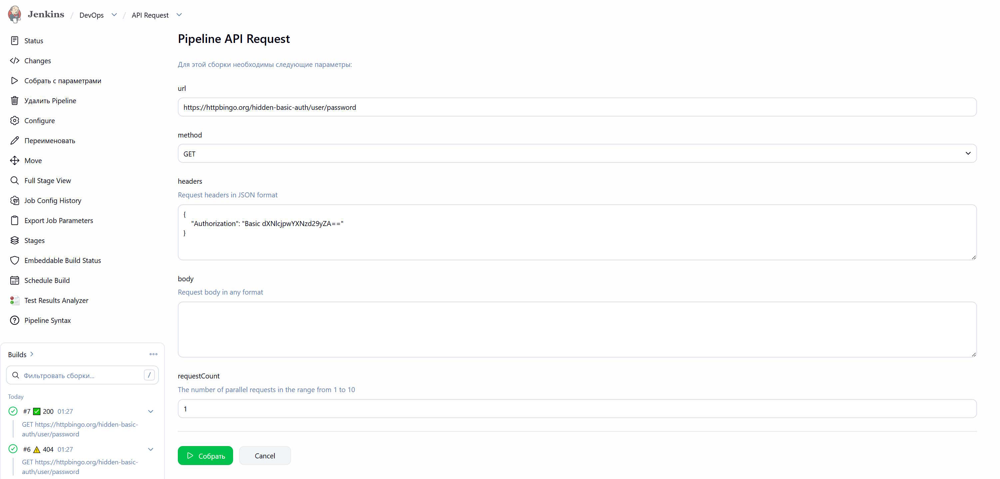
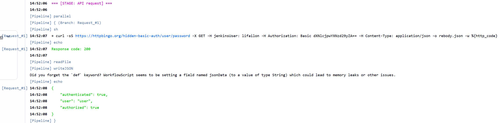

# API Request

Универсальный Jenkins Pipeline для формирования и отправки HTTP-запросов с помощью `curl`.

- Конвейер поддерживает выбор метода, передачу заголовков и тела запроса:

- В логе отображает итоговая команда запроса и форматированный вывод ответа в формате `json`:

