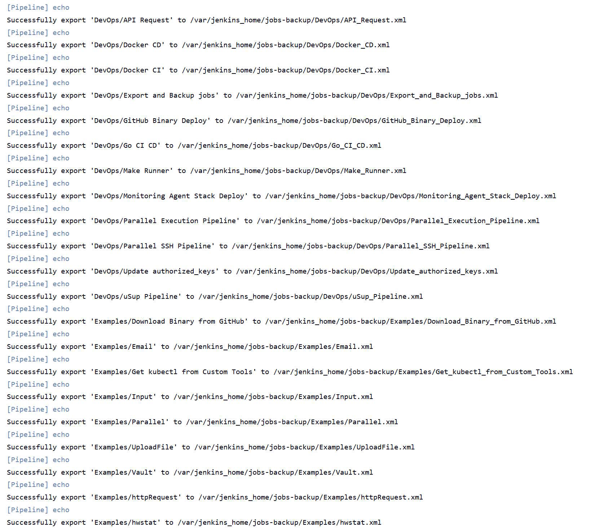
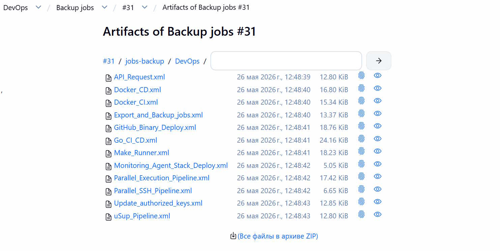
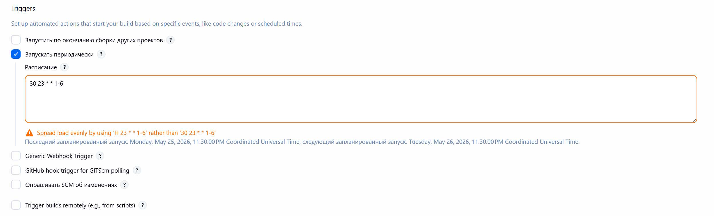

# Backup jobs

Универсальный Jenkins Pipeline и Groovy [скрипт](backup.groovy) для резервного копирования всех jobs и экспорта в артифакты по расписанию.

- Экспорт:



- Артифакты:



- Настройка расписания по будням в 23:30:

```groovy
triggers {
    cron('30 23 * * 1-5')
}
```

> [!NOTE]
> Для работоспособности запланированных заданий с использованием трггера `cron`, установите значение по умолчанию для параметра `credentials`.

