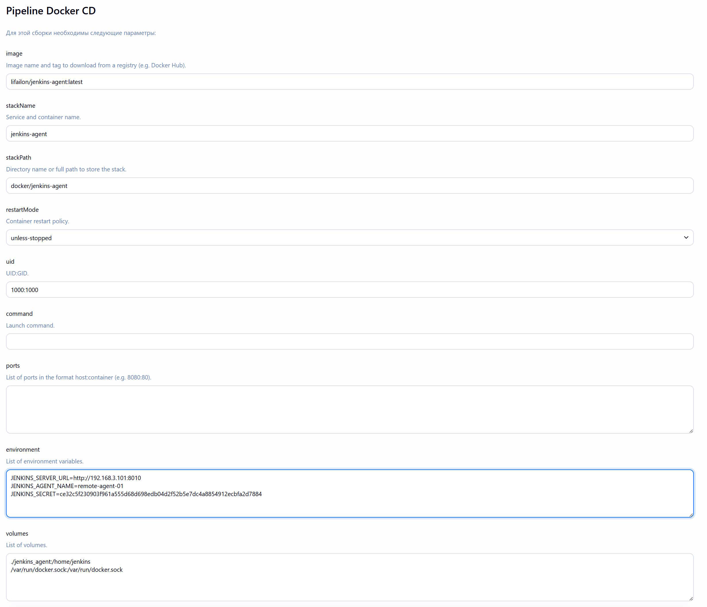
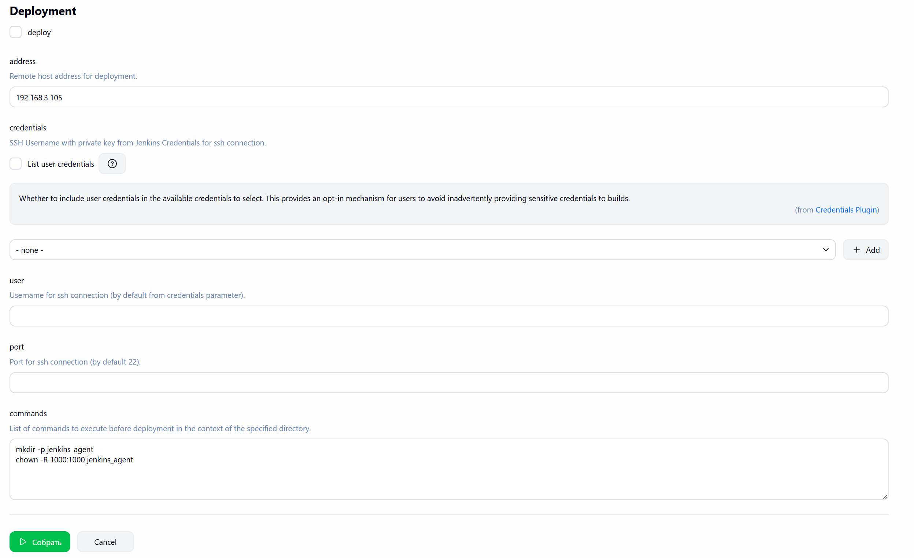
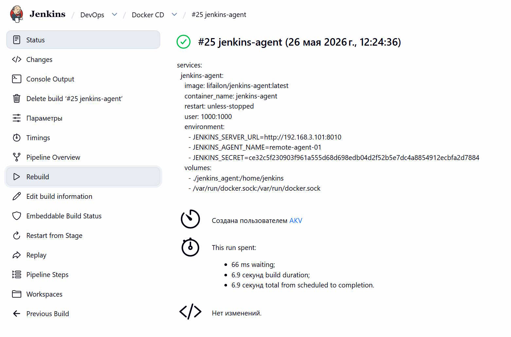

# Docker CD

Универсальный конструктор для генерации файла `docker-compose` и развертывания контейнеров на удаленном хосте.

- Параметры для генерации:

- Параметры для развертвывания:

- Содержимое `docker-compose` файла после генерации:

> [!NOTE]
> Используйте плагин [Rebuilder](https://plugins.jenkins.io/rebuild) для обновления параметров и перезапуска контейнера или быстрого развертвывания на другом хосте.

