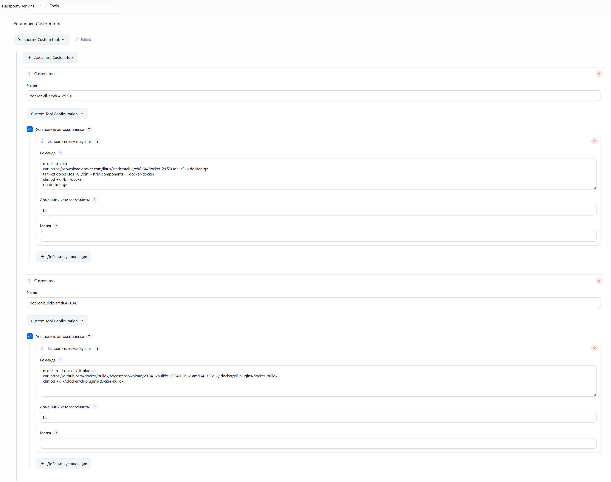
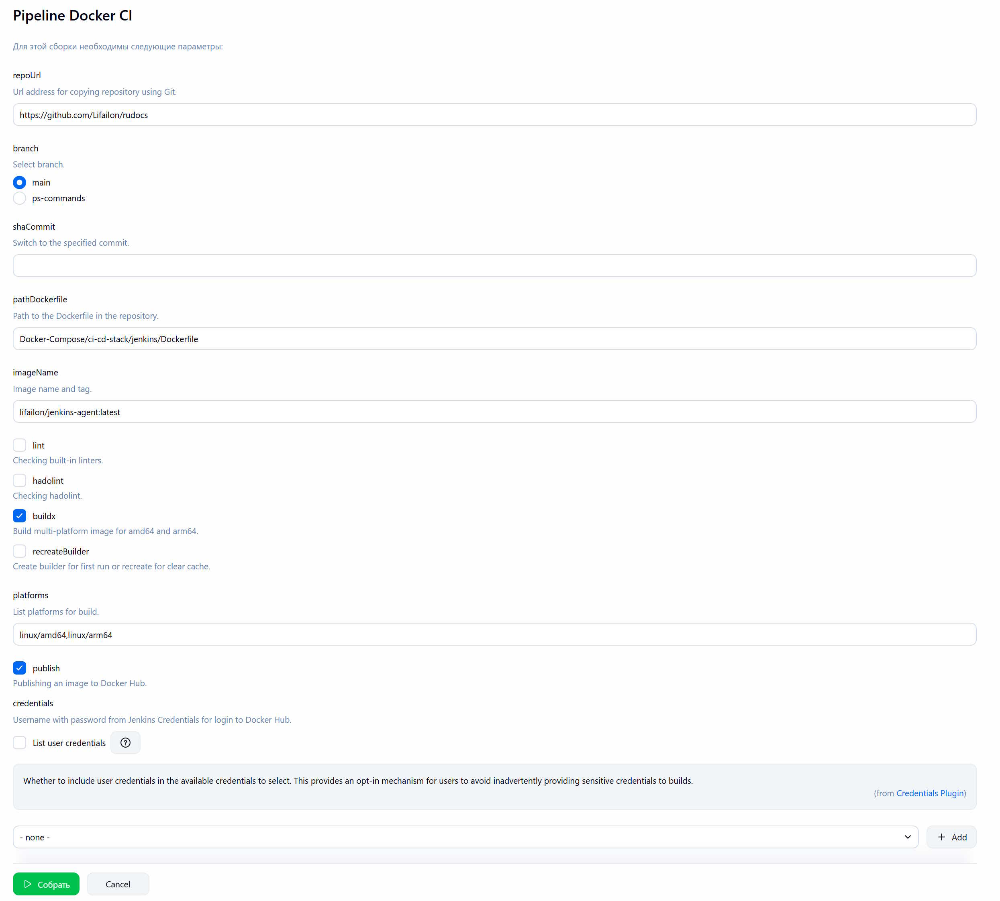
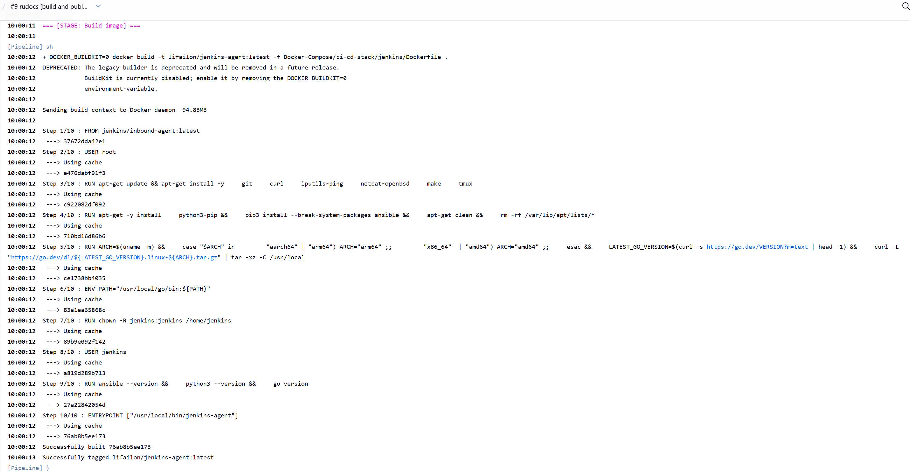
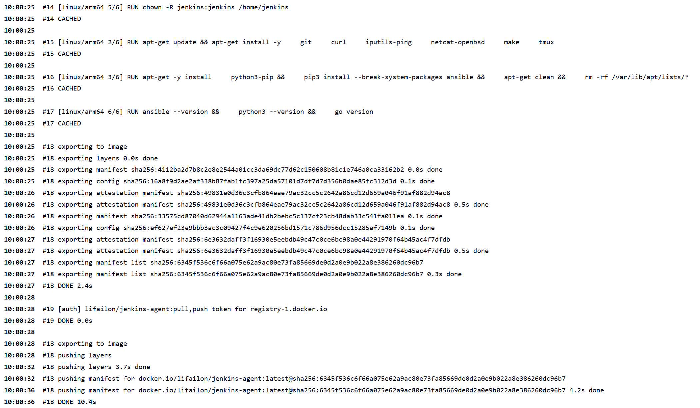

# Docker CI

Универсальный Jenkins Pipeline для сборка Docker образа из GitHub репозитория и публикации в Docker Hub.

Поддерживается переключение на любой указанный коммит в истории репозитория перед сборкой, мультиплатформенную сборку с помощью [Buildx](https://github.com/docker/buildx), а также проверку `Dockerfile` с помощью встроенных линтеров и [Hadolint](https://github.com/hadolint/hadolint).

> [!NOTE]
> Перед первой сборкой необходимо создать сборщика с помощью параметра `recreateBuilder`.

- Настройка Custom Tools для установки Docker cli и плагина `buildx`:

- Параметры:

- Лог сборки и публикации образа:

> [!NOTE]
> В примере используется образ [Jenkins агента](/Docker-Compose/ci-cd-stack/jenkins/Dockerfile), который я использую для запуска сборщиков в своей домашней среде.

