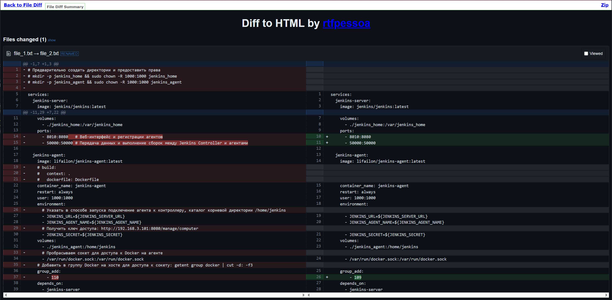

# File diff

Универсальный Jenkins Pipeline для сравнения двух файлов и формирования отчета в формате HTML, используя инструмент [diff2html](https://github.com/rtfpessoa/diff2html) и плагин [HTML Publisher](https://plugins.jenkins.io/htmlpublisher).

> [!NOTE]
> Для работы конвейера требуется, чтобы был на агенте-сборщике был установлен [node-js](../custom-tools/node-js-24.17.0.sh) с помощью Custom Tools.

Пример отчета:

