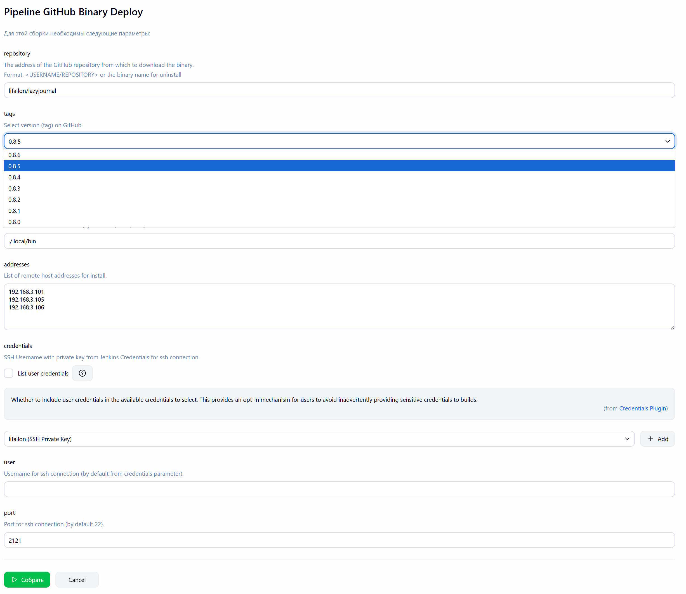
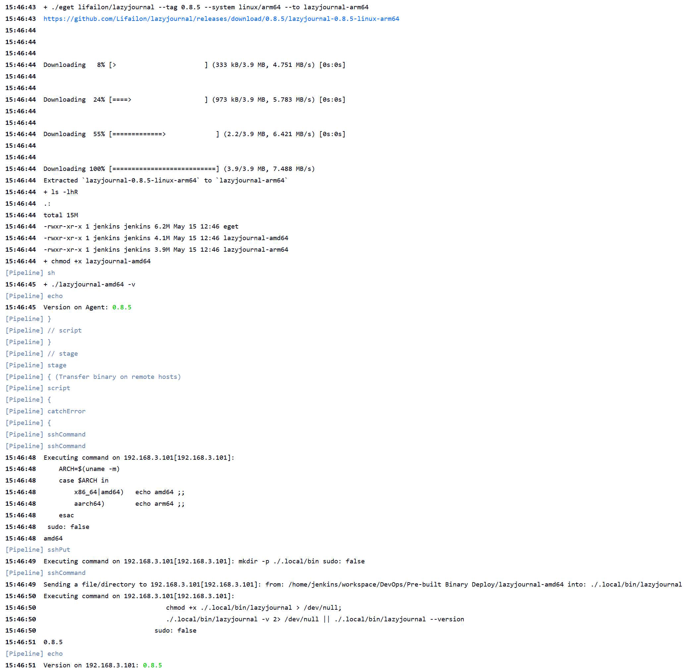

# GitHub Binary Deploy

Jenkins Pipeline для автоматизации установки и удаления на удаленных хостах предварительно собранных бинарных файлов выбранной релизной версии из репозитория GitHub с помощью [eget](https://github.com/zyedidia/eget).

Пайплайн устанавливает последнюю версию `eget` на агенте, затем загружается бинарный файл выбранной версии из репозитория GitHub для двух архитектур (`amd64` и `arm64`), проверяет версию на сборщике, передает бинарный файл на удаленные хосты в указанный каталог, предоставляет права на выполнение и проверяет версию на удаленном хосте.

- Параметры:

- Лог загрузки и установки [lazyjournal](https://github.com/Lifailon/lazyjournal):

