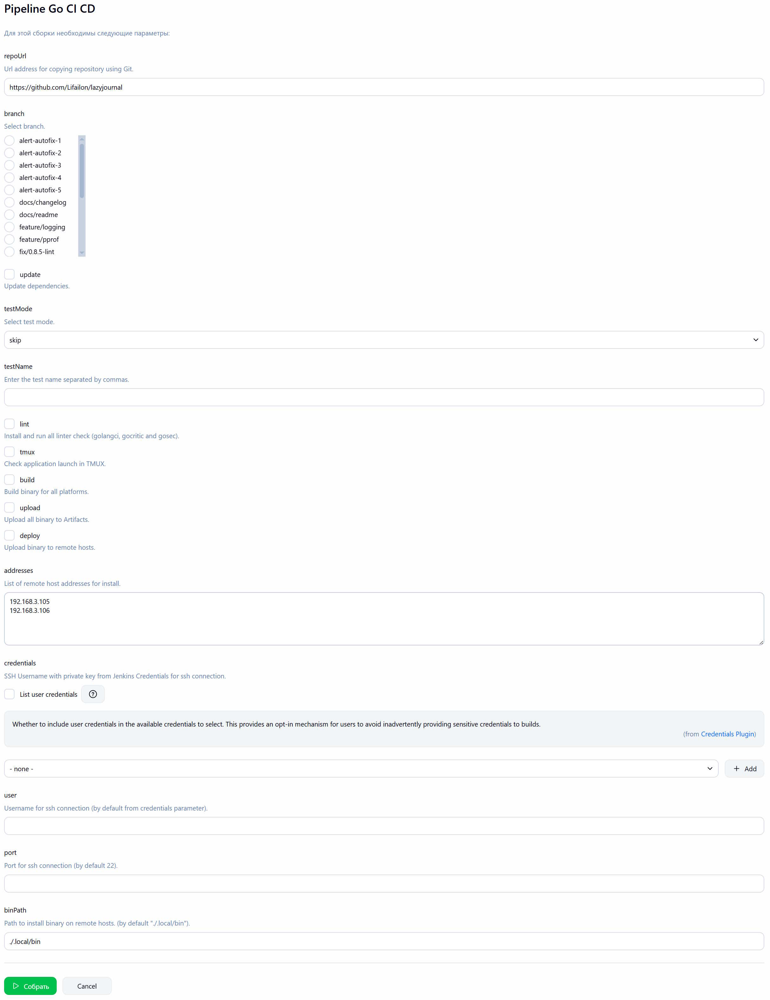
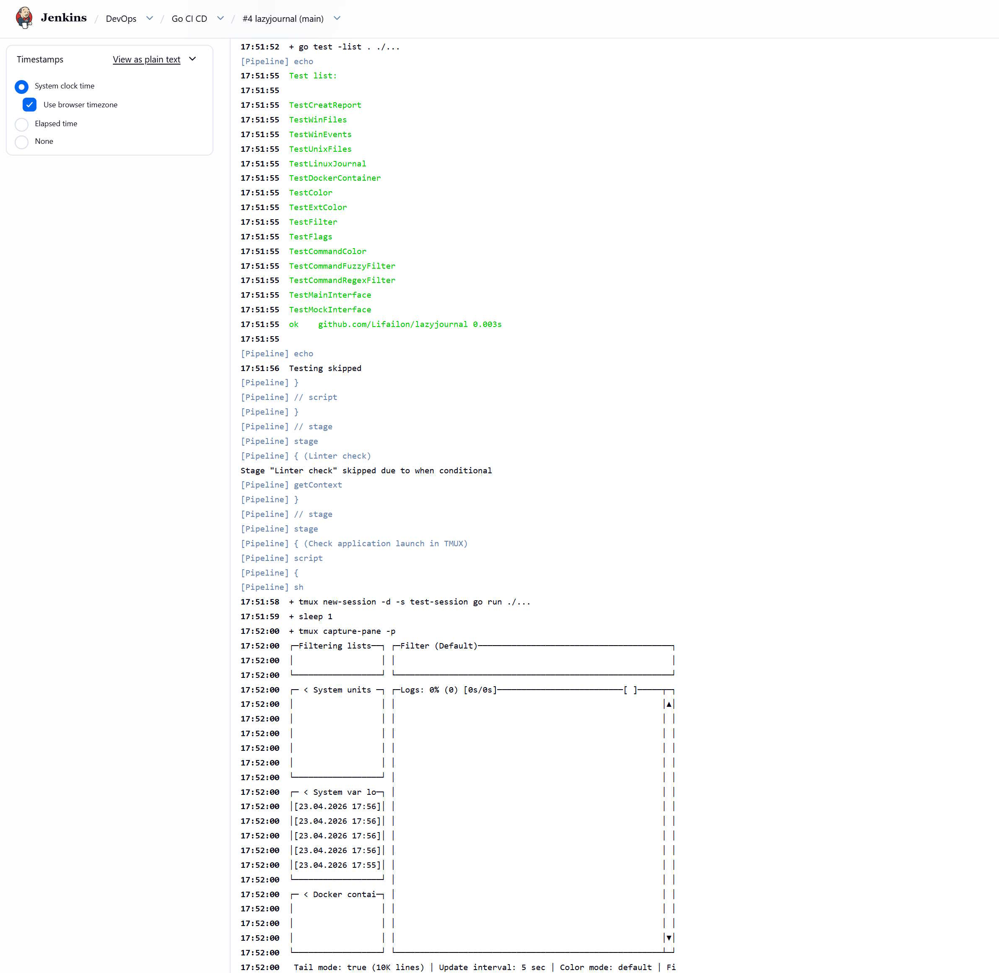
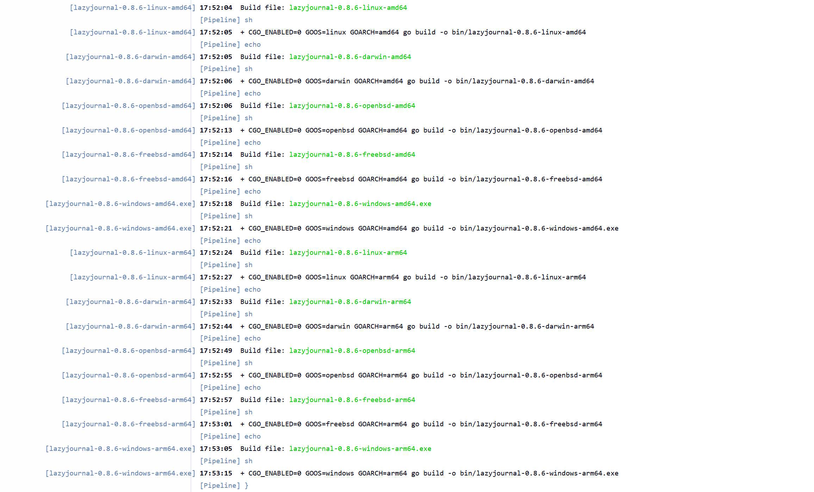
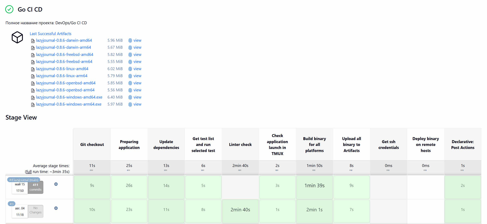

# Go CI/CD

Универсальный Jenkins Pipeline для автоматизации процесса CI/CD (сборки, тестирования и развертывания) любого приложения на Go из репозитория GitHub.

Поддерживает следующие функции:

- Опредиление списка веток и клонирование указанного репозитория.
- Базовый набор команд Go для подготовки и проверки запуска приложения.
- Обновление зависимостей.
- Получение списка доступных тестов с возможностью запуска всех или перечисленных.
- Установка и проверка линтеров с помощью [golangci](https://github.com/golangci/golangci-lint), [gocritic](https://github.com/go-critic/go-critic) и [gosec](https://github.com/securego/gosec).
- Запуск приложения в `TMUX` для проверки отрисовки интерфейса.
- Параллельная сборка бинарных файлов для всех платформ и архитектур (версия определяется автоматически из флага `-v` или `--version`), а также их загрузка в артефакты.
- Развертывание на удаленных хостах путем копирования подготовленного бинарного файла в указанный каталог с определением архитектуры.

Параметры:

Список тестов и запуск интерфейса в TMUX:

Сборка:

Артифакты:

