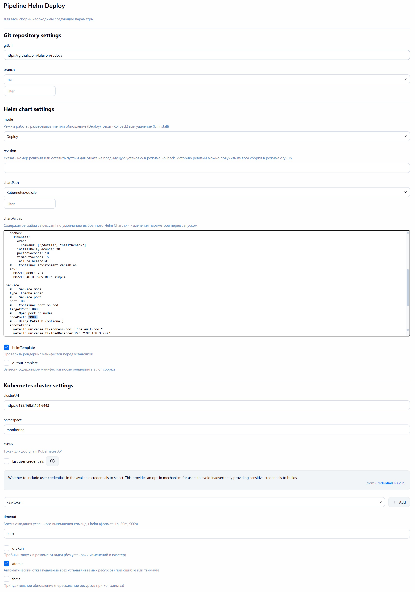
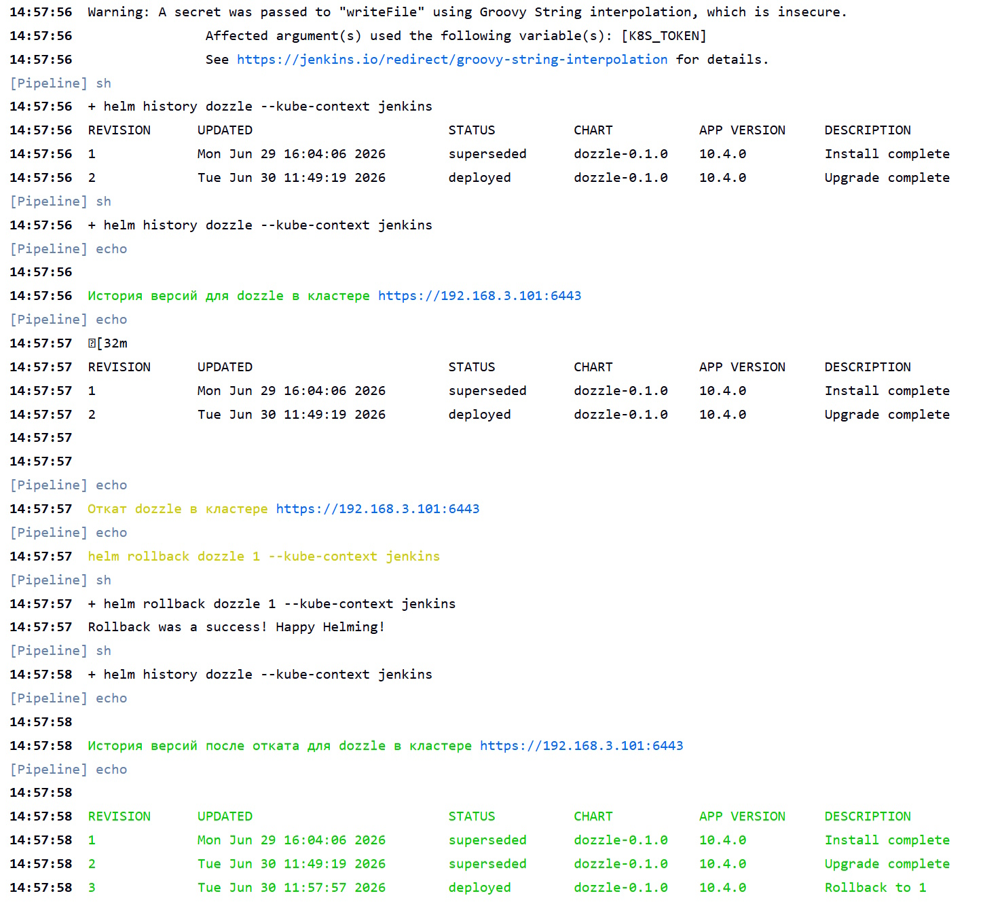

# Helm Deploy

Универсальный Jenkins Pipeline для установки любого Helm Chart из указанного репозитория.

Поддерживается режим развертвывание или обновление (Deploy), откат (Rollback) на предыдущую или указанную ревизию, а также удаление чарта из кластера.

Параметры конвейера поддерживают автоматический поиск всех Helm Chart в указанном репозитории с помощью GitHub API (поиск по файлу `Chart.yaml`) и вывод содержимого файла `values.yaml` по умолчанию для редактирования параметров выбранного чарта перед запуском.

В процессе работы формируется `kubeconfig` на основе переданных параметров, отображаются изменения (diff) содержимого файла `values.yaml` из параметров Jenkins с исходным файлом в репозитории, а также проверяется рендеринг манифестов.

- Создайте секрет (типа `string`) с произвольным название (например, `k3s-token`) с содержимым токена для доступа к кластеру Kubernetes.

- Параметры:

- Историю ревизий можно получить из лога сборки в режиме `dryRun`:

