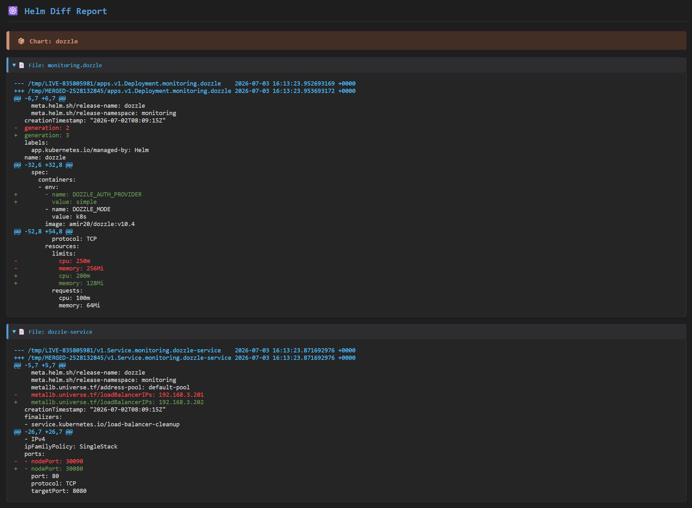

# Helm Diff

Универсальный Jenkins Pipeline для сравнения Helm Chart из указанного репозитория (GitOps) с состоянием в кластере.



Для поддержки CSS-кода в отчете с помощью плагина [HTML Publisher](https://plugins.jenkins.io/htmlpublisher), отключите политику безопасности `CSP` в консоли Jenkins:

```groovy
System.setProperty("hudson.model.DirectoryBrowserSupport.CSP", "")
```