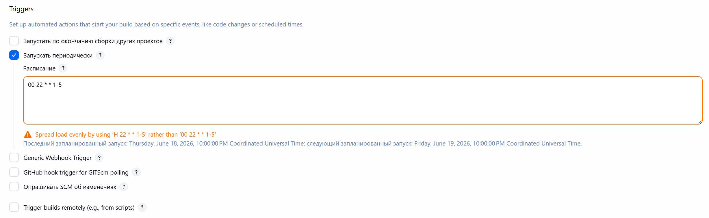
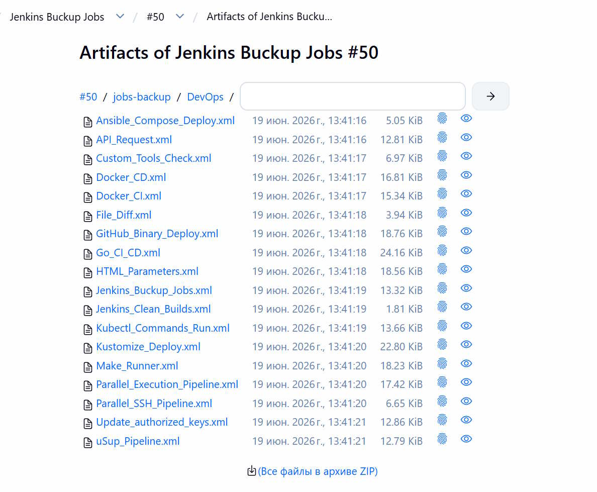

# Jenkins Backup Jobs

Универсальный Jenkins Pipeline для резервного копирования всех проектов (jobs) на сервере Jenkins с их экспортов в артифакты по расписанию.

- Создайте секрет `jenkins-api-cred` с содержимым авторизационных данных в Jenkins для доступа к Jenkins API.

- Настройка расписания по будням в 22:00:

```groovy
triggers {
    cron('00 22 * * 1-5')
}
```



- Выгрузка артифактов:

