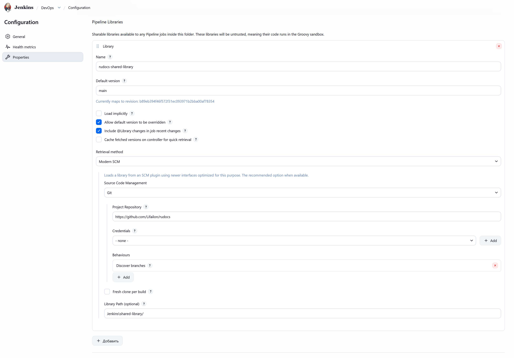
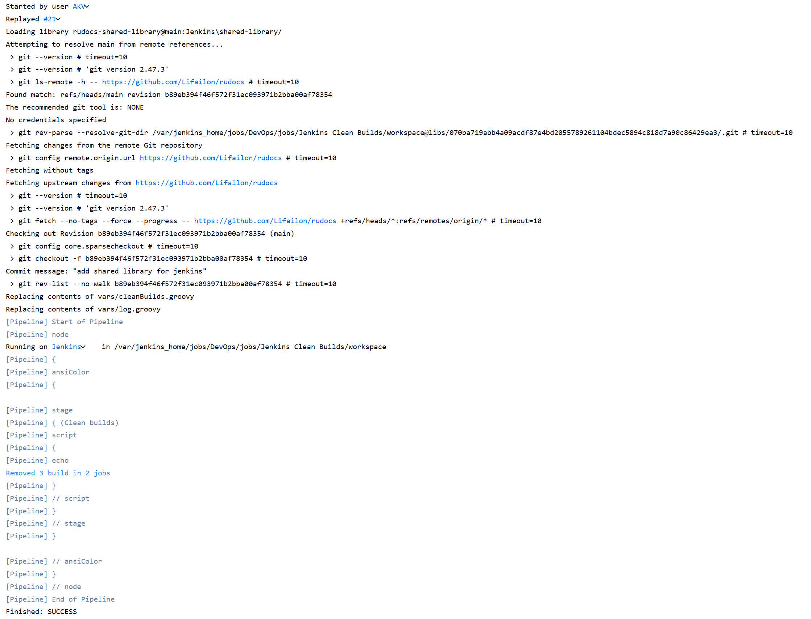

# Jenkins Clear Builds

Универсальный Jenkins Pipeline для очистики старых сборок (до указанного количества последних сборок, которые требуется оставить) во всех проектах по расписанию.

Для работы Pipeline требуется подключить Shared Library, где содержится скрипт очистки:

Пример сборки:

