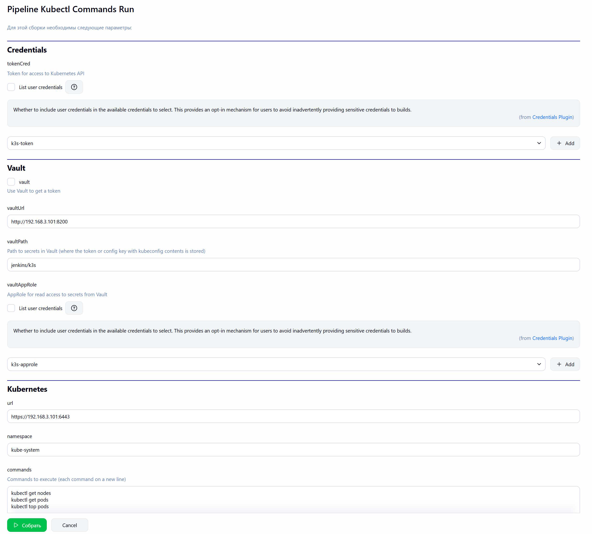
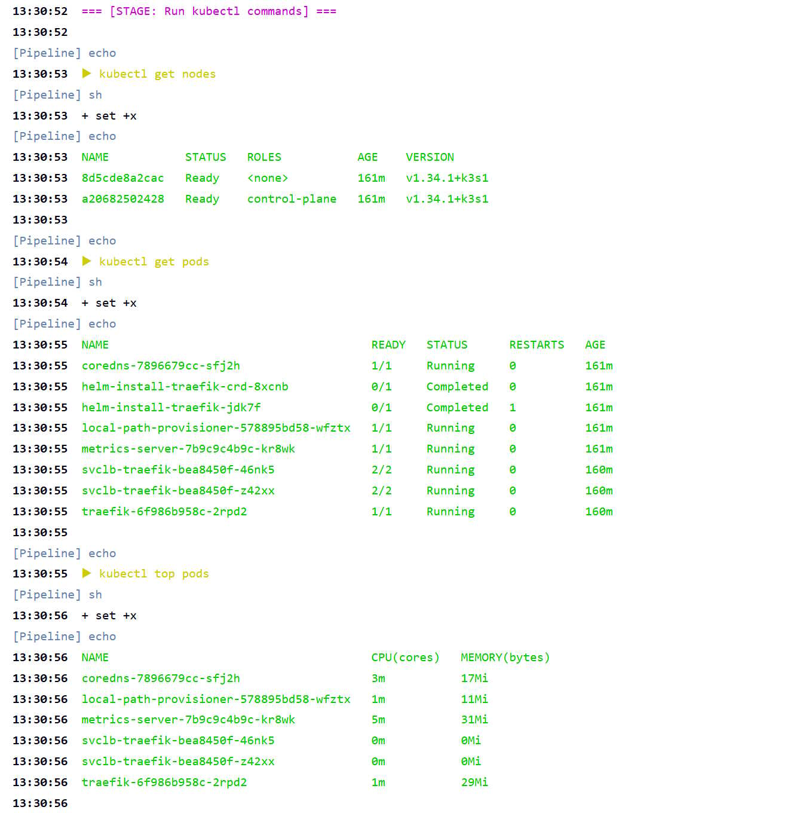

# Kubectl Commands Run

Универсальный Jenkins Pipeline для выполнения произвольных команд в кластере Kubernetes.

Для подключения к кластерам Kubernetes используется Token, который извлекается напрямую из Jenkins Credentials или Vault с помощью AppRole.

Для установки [kubectl](https://github.com/kubernetes/kubectl) на сборщике Jenkins используется Custom Tools:

```bash
mkdir -p ./bin
curl -sSL https://dl.k8s.io/release/v1.36.0/bin/linux/amd64/kubectl -o ./bin/kubectl
chmod +x ./bin/kubectl
```

- Параметры:



- Лог выполнения:

