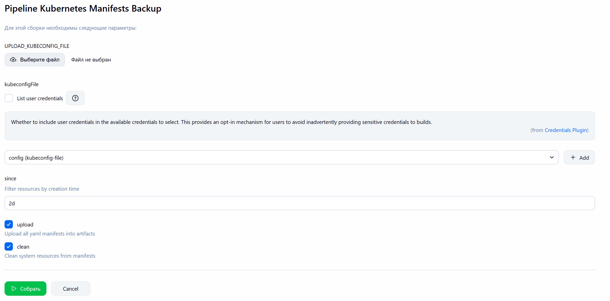
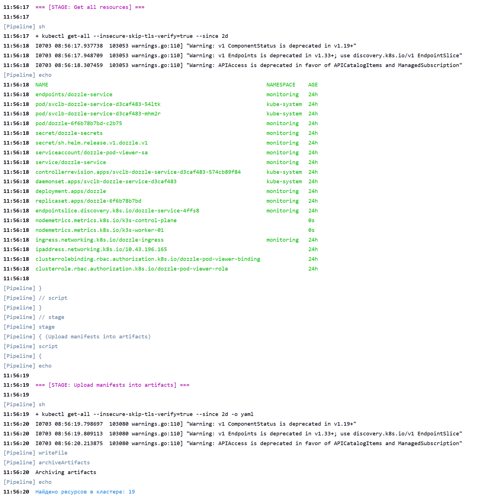
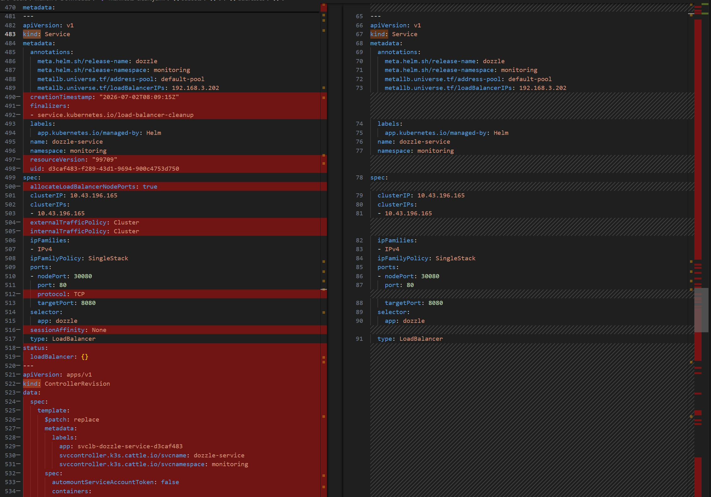

# Kubernetes Manifests Backup

Универсальный Jenkins Pipeline для получения информации о всех ресурсах в кластере Kubernetes с помощью плагина [ketall](https://github.com/corneliusweig/ketall), а также резервного копирования всех пользовательских манифестов (исключая системные ресурсы, например, `pod` или `ReplicaSet`) и очистки содержимого от системных метаданных с помощью плагина [neat](https://github.com/itaysk/kubectl-neat).

Для установки плагинов, используется менеджер плагинов [Krew](https://github.com/kubernetes-sigs/krew), который в свою очередь устанавливается с помощью скрипта [Custom Tool](../custom-tools/krew-0.5.0.sh).

Для подключения к кластерам Kubernetes используется [kubectl tool](../custom-tools/kubectl-1.36.0.sh) и `kubeconfig`, который можно передать в сборку с помощью Jenkins File Credentials или [File Parameters](https://www.jenkins.io/doc/pipeline/steps/file-parameters) (имеет повышенный приоритет).

- Параметры:

> [!NOTE]
> Поддерживается фильтрация по времени создания ресурсов с помощью параметра `since`.

- Вывод:

- Сравнение манифестов до и после очистки:

