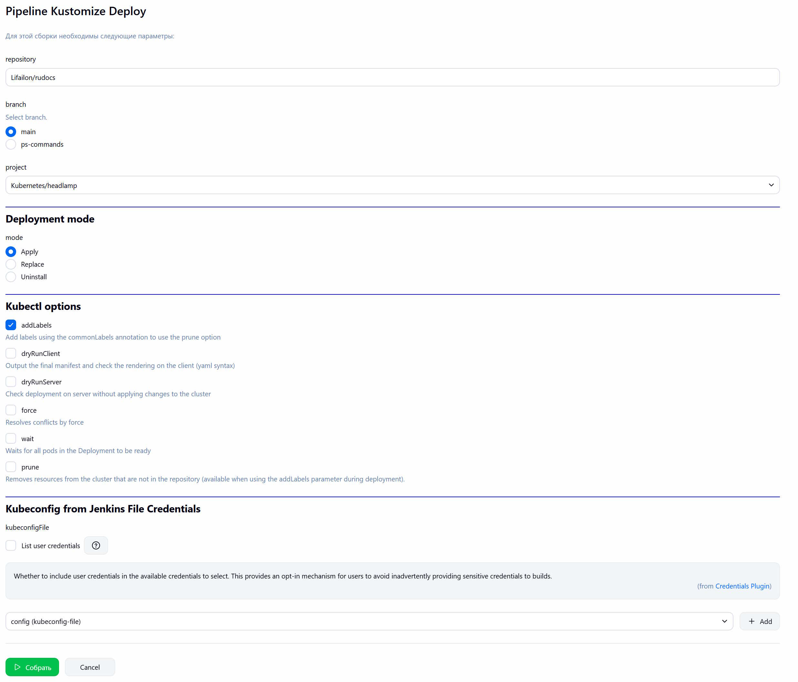
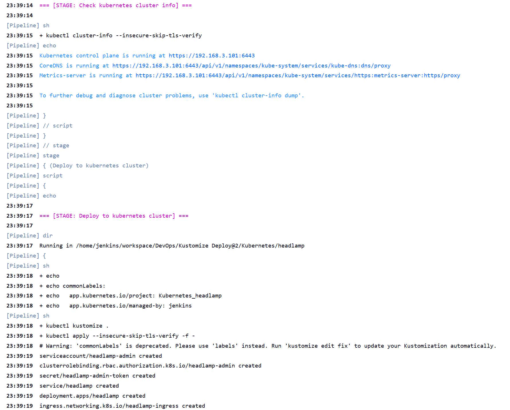

# Kustomize Deploy

Универсальный Jenkins Pipeline для развертвывания манифестов в кластере Kubernetes из репозитория GitHub с помощью [Kustomize](https://github.com/kubernetes-sigs/kustomize).

Поддерживает несколько режимов работы и настройку опций `kubectl`. Активный параметр `project` сканирует указанный репозиторий на наличие файлов `kustomization.yaml` и выводит список директорий - проектов для развертвывания.

Для подключения к кластерам Kubernetes используется файл `kubeconfig` из Jenkins File Credentials или с помощью [File Parameters](https://www.jenkins.io/doc/pipeline/steps/file-parameters) (имеет повышенный приоритет, необходимо передавать перед каждой сборкой).

Для установки [kubectl](https://github.com/kubernetes/kubectl) на сборщике Jenkins используется Custom Tools:

```bash
mkdir -p ./bin

VERSION=v1.36.0

ARCH=$(uname -m)
case $ARCH in
    x86_64|amd64) ARCH="amd64" ;;
    aarch64) ARCH="arm64" ;;
esac

curl -sSL https://dl.k8s.io/release/$VERSION/bin/linux/$ARCH/kubectl -o ./bin/kubectl
chmod +x ./bin/kubectl
```

- Параметры:



- Лог развертвывания:

