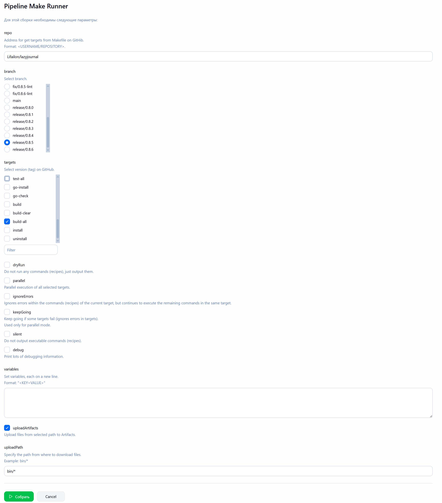
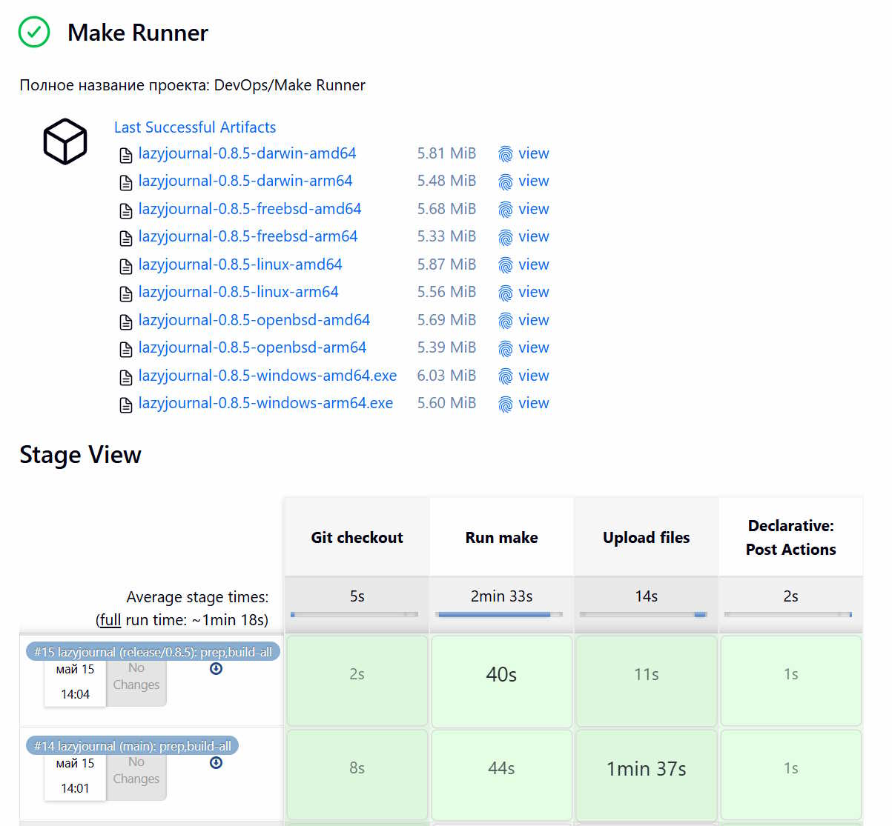

# Make Runner

Универсальный Jenkins Pipeline для запуска `make` из удаленного публичного репозитория GitHub.

Параметр `targets` автоматически определяет все доступные цели в основном `Makefile` указанного репозитория из выбранной ветки.

Поддерживается выбор нескольких целей, переопредилекние флагов (например, параллельный режим работы) и изменение переменных, а также возможность загрузки артифактов из указанного каталога, например, после сборки приложения.

- Доступные параметры:

- Выгрузка артифактов:

> [!NOTE]
> Обратите внимание на название ветки (которое соответствует версии бинарных файлов в архитфактах) и выбранные цели в название сборки.