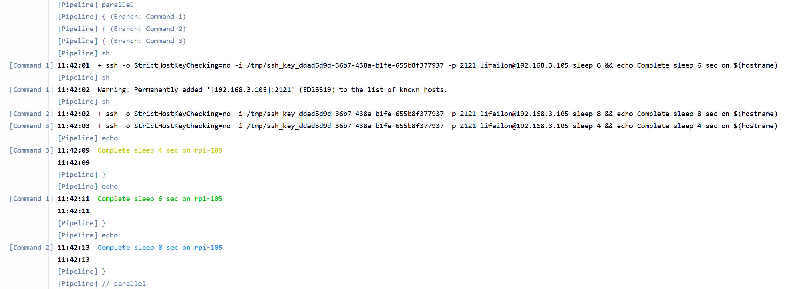
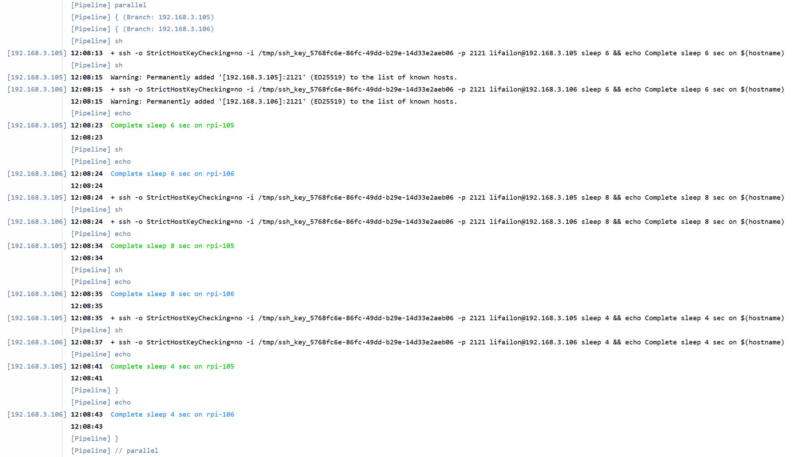

# Parallel Execution Pipeline

Это Jenkins Pipeline, который я использую в своей домашней среде для автоматизации выполнения команд на одном или нескольких удаленных хостах.

Поддерживает 2 режима работы:

- Параллельное выполнение команд на одном хосте.
- Последовательное выполнение команд на нескольких хостах параллельно (используя параметр `multiHosts`).

Для поддержки уникального цвета в выводе с каждого отдельного хоста используется параметр `color` (требуется, чтобы на агенте-сборщике был установлен клиент `OpenSSH`).

Пример списка команд для выполнения:

```bash
sleep 6 && echo Complete sleep 6 sec on $(hostname)
sleep 8 && echo Complete sleep 8 sec on $(hostname)
sleep 4 && echo Complete sleep 4 sec on $(hostname)
```

- Результат выполнения на одном хосте:



> [!NOTE]
> Обратите внимание на порядок выполнения команд.

- Результат выполнения на двух хостах:



> [!NOTE]
> Обратите внимание на время выполнения команды по встроенному `timestamp`.