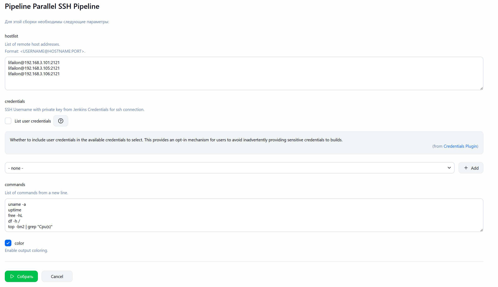
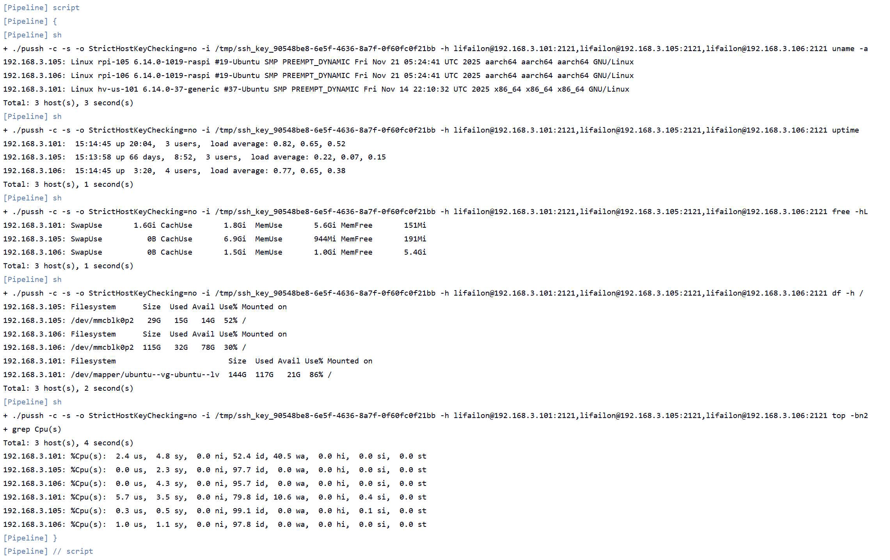

# Parallel SSH Pipeline

Jenkins Pipeline представляет собой параметризованный интерфейс для скрипта [pussh](https://github.com/bearstech/pussh) с целью параллельного выполнения переданных команд на нескольких хостах (требуется, чтобы на агенте-сборщике был установлен клиент `OpenSSH`). Подсветка вывода и параллельное выполнение команд на одном хосте не поддерживается.

- Параметры:

- Пример получения базовой информации о системе на 3 хостах:

