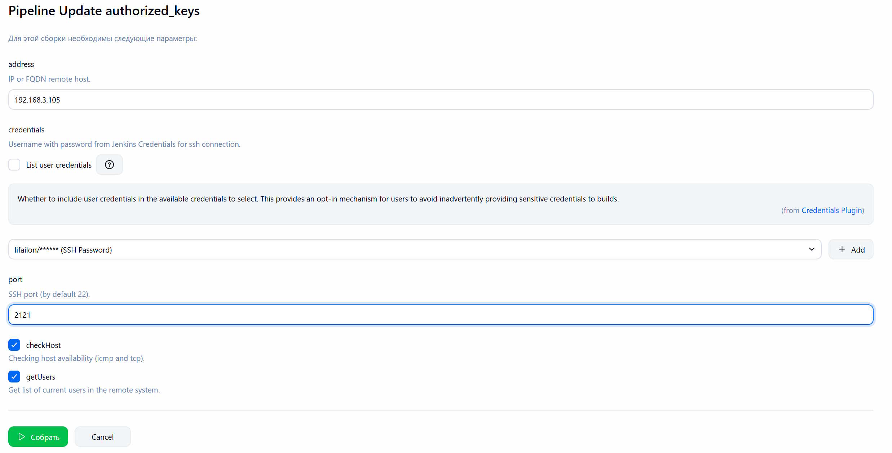
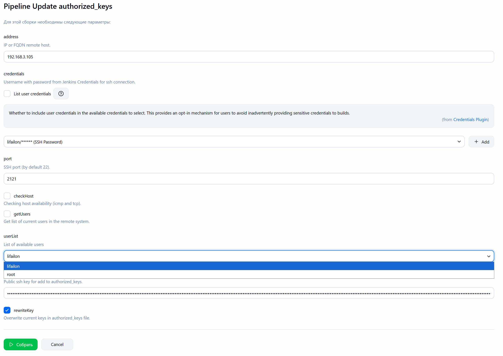

# Update authorized_keys

Jenkins Pipeline работает в двух режимах: сначала получает список пользователей на удаленном хосте (подключение производится по SSH с использованием пароля) и обновляет параметр со списком активных пользователей, а затем при повторном запуске перезаписывает все ключи или добавляет новый ключ в `authorized_keys` для выбранного пользователя и возвращает параметры к значениям по умолчанию.

- Параметры для получения списка пользователей

- Параметры для обновления ключа:

